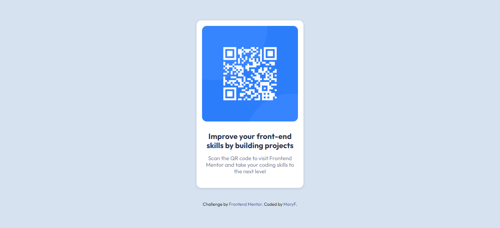

# Frontend Mentor - QR code component solution

This is a solution to the [QR code component challenge on Frontend Mentor](https://www.frontendmentor.io/challenges/qr-code-component-iux_sIO_H). Frontend Mentor challenges help you improve your coding skills by building realistic projects. 

## Table of contents

- [Overview](#overview)
  - [Screenshot](#screenshot)
  - [Links](#links)
- [My process](#my-process)
  - [Built with](#built-with) 
  - [Continued development](#continued-development)
 
- [Author](#author)

## Overview

### Screenshot

### Links

- Solution URL: (https://github.com/Janselin/qr-code-component)
- Live Site URL:(https://janselin.github.io/qr-code-component)

## My process

### Built with

- Semantic HTML5 markup
- CSS custom properties
- Flexbox
- BEM

### Continued development

Taking this challenge as an oportunity to keep practising BEM.

## Author

- Website - (https://github.com/Janselin)
- Frontend Mentor -(https://www.frontendmentor.io/profile/Janselin)

